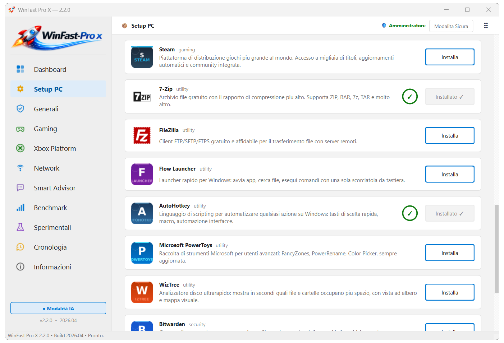
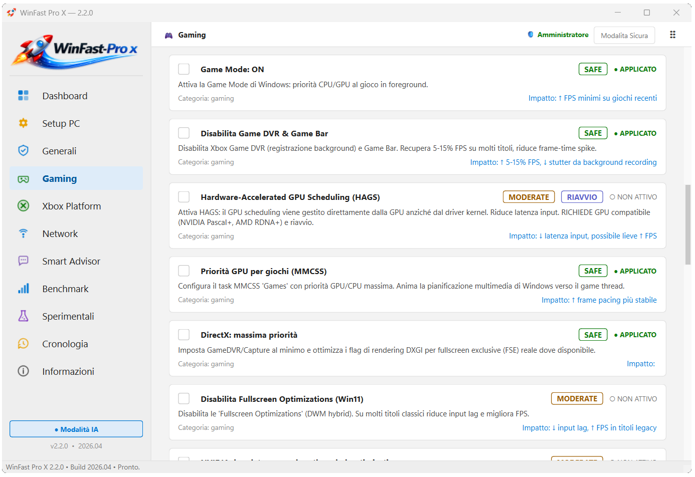
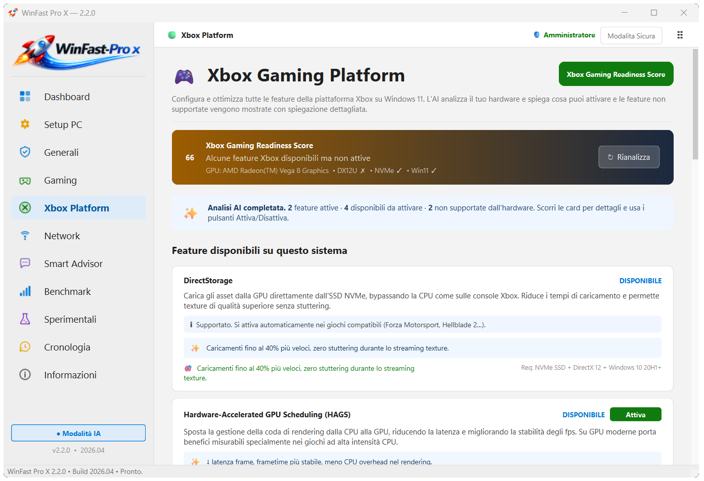
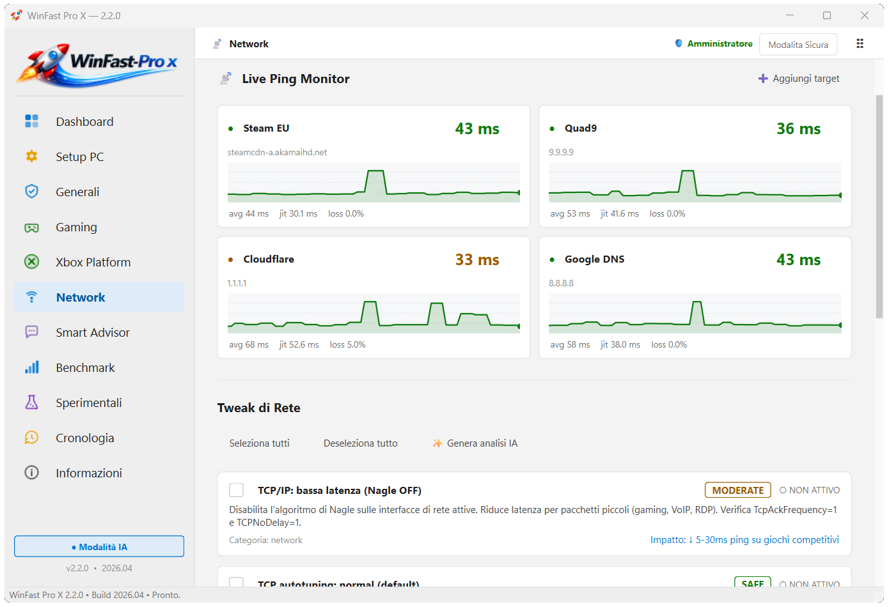
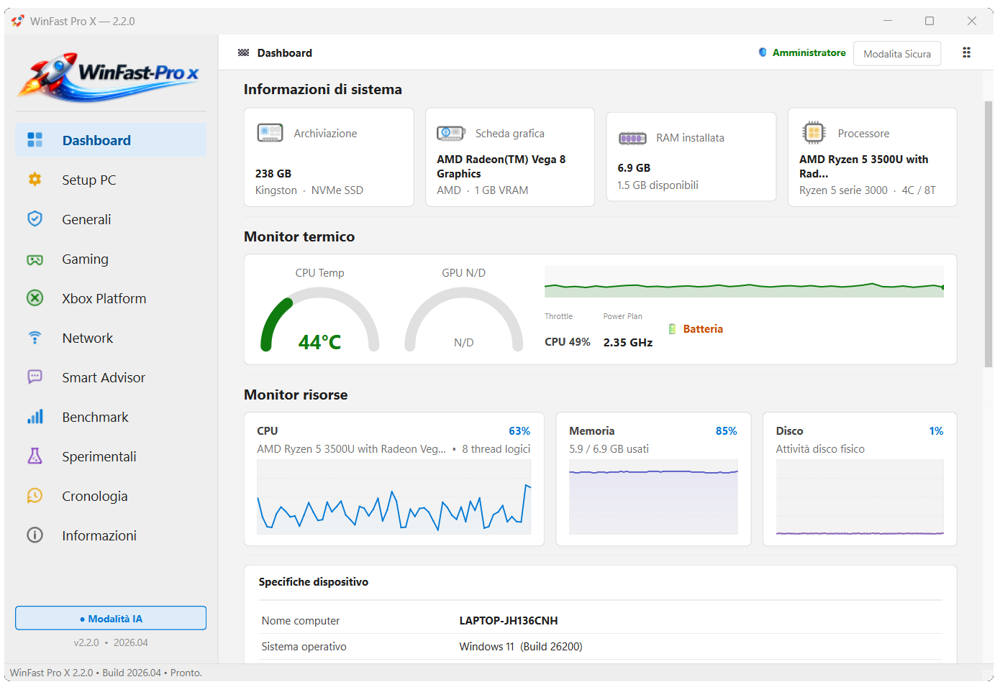

<div align="center">


# WinFast Pro X

### 🚀 Suite di Ottimizzazione Windows di Nuova Generazione

**Gratuito. Freeware. Nessun account. Nessuna telemetria. Nessun trucco.**

[](https://www.studio1informatica.it/soft/WinFastProX_Setup_2.2.0.exe)
[](https://github.com/StudioOne-IT/winfast)
[](LICENSE.txt)
[](https://www.studio1informatica.it)
[](https://buymeacoffee.com/fbaldi)

[⬇️ Download](#-download) • [✨ Funzionalità](#-funzionalità) • [📸 Screenshot](#-screenshot) • [🧬 Libreria Tweak](#-libreria-tweak-completa) • [❓ FAQ](#-faq) • [☕ Donazioni](#-supporta-il-progetto)

---

> **"Lo strumento di ottimizzazione che Windows avrebbe dovuto includere."**
> Costruito da uno sviluppatore ossessionato dalla latenza, per gamer, streamer e creator che si rifiutano di lasciare prestazioni sul tavolo.

</div>

---

## 🎯 Cos'è WinFast Pro X?

WinFast Pro X è una **suite di ottimizzazione Windows gratuita e all-in-one** progettata per **gamer, streamer, creator di contenuti e power user** che vogliono ogni millisecondo di prestazione che il loro hardware può offrire — senza bloatware, abbonamenti, o pericolose modifiche di registro alla cieca.

A differenza dei generici "ottimizzatori" che spingono cleaner fasulli e software sponsorizzato, WinFast Pro X è costruito su **vera conoscenza degli internals di Windows**: scheduling del kernel NT, override ACPI non documentati, analisi di simboli PDB e ricerca originale. Ogni singolo tweak mostra il suo **impatto misurabile nel mondo reale** prima che tu lo applichi.

**La differenza chiave:**
- ✅ Ogni tweak è **documentato** con stime di impatto reali
- ✅ **Punto di Ripristino** automatico prima di ogni modifica
- ✅ **Rollback completo** di qualsiasi tweak individuale, in qualsiasi momento
- ✅ **Analisi AI** della tua specifica configurazione hardware
- ✅ **Zero telemetria** — tutta l'analisi gira localmente

---

## ✨ Funzionalità

### 🎮 Ottimizzazione Gaming

| Funzione | Cosa fa |
|---|---|
| **Game Boost One-Click** | Applica il set ottimale di tweak per la tua GPU (NVIDIA/AMD/Intel) e CPU in un click — profilo hardware rilevato automaticamente |
| **Xbox Platform Hub** | Rileva la compatibilità e attiva Auto HDR, DirectStorage, HAGS, VRR, Game Mode e Dynamic Latency Input |
| **Latency Sniper** | Monitor processi in tempo reale che mostra quali app in background rubano tempo CPU mentre giochi |
| **GPU Priority Boost** | Imposta la GPU su priorità di scheduling alta via HKLM — riduzione misurabile della varianza del frame time |
| **HAGS** | Hardware-Accelerated GPU Scheduling — riduce l'overhead di sincronizzazione CPU-GPU |
| **Disabilita MPO** | Elimina gli artefatti Multi-Plane Overlay che causano micro-stuttering su setup multi-monitor |
| **Game DVR Off** | Disabilita la registrazione in background di Xbox Game Bar che consuma CPU e disco |
| **Ottimizzazione DX** | Forza i feature level DirectX ottimali e disabilita i layer di debug DXGI |

### ⚙️ Prestazioni di Sistema

| Funzione | Cosa fa |
|---|---|
| **Process Boost** | Disabilita il power throttling di Windows, imposta la massima priorità foreground dello scheduler (Win32PrioritySeparation=0x26), riduce l'aggressività del core parking al 10% |
| **Piano Alte Prestazioni** | Attiva il piano energetico Alte Prestazioni — impedisce lo scaling della frequenza CPU |
| **SysMain Off** | Disabilita il servizio SuperFetch che causa thrashing del disco su sistemi SSD |
| **Windows Search Off** | Disabilita il servizio di indicizzazione — recupera larghezza di banda I/O |
| **Ottimizzazione Memoria** | Ottimizza paging executive, large system cache e I/O page lock limit per latenza minima |
| **Velocità Avvio** | Disabilita il ritardo di boot, ottimizza la sequenza di avvio |
| **Timer Shutdown App** | Riduce WaitToKillAppTimeout da 20s a 2s — i programmi si chiudono istantaneamente |
| **Effetti Visivi** | Preset "ottimizza per prestazioni" in un click — rimuove trasparenza, ombre, animazioni |

### 📡 Rete e Latenza

| Funzione | Cosa fa |
|---|---|
| **Disabilita Nagle** | Disabilita l'algoritmo di Nagle su tutte le interfacce di rete attive — riduce la latenza dei pacchetti di 5–30ms nel gaming competitivo |
| **Ottimizzazione TCP** | Ottimizza il receive window TCP, abilita il controllo di congestione BBR-style |
| **DNS Cloudflare** | Passa tutte le interfacce a Cloudflare 1.1.1.1 / 1.0.0.1 — DNS pubblico più veloce, privacy-first |
| **NIC Power Save Off** | Impedisce a Windows di spegnere le schede di rete — elimina le micro-disconnessioni e il jitter Wi-Fi |
| **Rimuovi Riserva QoS** | Rimuove la riserva del 20% di banda imposta da GQOS |
| **Monitor Ping Live** | Grafico latenza in tempo reale verso i principali server gaming e host personalizzati |

### 🧠 AI Smart Advisor

L'Smart Advisor integrato esegue un'**analisi consapevole dell'hardware** della tua specifica configurazione:
- Legge modello CPU, numero di core, produttore GPU, quantità RAM e tipo di storage
- Genera raccomandazioni personalizzate di tweak classificate per impatto stimato
- Identifica ottimizzazioni specifiche per hardware (AMD Ryzen vs Intel, NVIDIA vs AMD GPU)
- Selettore profilo: **Gaming** / **Bilanciato** / **Professionale / Streaming**
- Powered by AI — analisi hardware completamente offline, raccomandazioni cloud opzionali

### 📊 Motore Benchmark

- **Benchmark integrato da 15 secondi**: throughput CPU, banda RAM, I/O disco, risposta scheduler OS
- Salva un **baseline** prima dei tweak, misura di nuovo dopo
- Confronto delta con percentuale di miglioramento esatta
- Risultati esportabili per la condivisione

### ⚗️ Experimental Lab — Tweak Esclusivi di Ricerca

> ⚠️ Sezione avanzata. Documentata, reversibile, ma pensata per power user.

WinFast Pro X include **14 tweak sperimentali** basati su ricerca originale sugli internals non documentati di Windows:

**4 tweak ESCLUSIVI non pubblicati altrove:**
- 🔬 **C-State Inhibition** via ACPI Registry Override — impedisce gli stati idle della CPU durante le sessioni di gaming
- 🔬 **Kernel Thread Quantum Long Variable + Foreground Boost 3×** — estende i time slice per i processi foreground
- 🔬 **KTHREAD Ideal Processor + I/O Priority Critical via IFEO** — assegna i thread di gioco ai core ottimali
- 🔬 **GPU TDR Adaptive Timeout + DPC Watchdog Tuning** — elimina i reset GPU per timeout sotto carico pesante

**Tweak sperimentali aggiuntivi:**
- Timer Resolution 0.5ms — alza la frequenza del timer NT per precisione sub-millisecondo
- MMCSS Audio Latency — ottimizza lo scheduler multimediale per la minima latenza audio
- IRQ Priority Boost — eleva la priorità interrupt per GPU e NIC
- Kernel Split-Lock Detection Disable — rimuove la penalità di serializzazione sull'accesso non allineato alla memoria
- E altri ancora...

### 📜 Cronologia e Rollback Completo

Ogni tweak applicato viene registrato permanentemente:
- Timestamp, stato precedente del sistema, risultato
- **Rollback per-tweak** — annulla qualsiasi singola modifica senza toccare le altre
- "Ripristina tutto" in un click allo stato pre-ottimizzazione
- Esportazione JSON della cronologia completa

### 📦 Setup PC — Installer Software

Installazione in un click dei migliori tool gratuiti per Windows:
- **Browser**: Chrome, Firefox, Opera
- **Sicurezza**: Studio One AV (antivirus + VPN + TOR)
- **Produttività**: LibreOffice, PDF24, Notepad++, 7-Zip
- **Media**: VLC, IrfanView, GIMP, Paint.NET
- **Gaming**: Steam
- **Utilità**: WizTree, AutoHotkey, FlowLauncher, Bitwarden
- Basato su **winget** — il package manager ufficiale Microsoft

---

## 📸 Screenshot

<div align="center">

| Installer Software | Modalità Gaming |
|:---:|:---:|
|  |  |

| Xbox Platform Hub | Ottimizzatore Rete |
|:---:|:---:|
|  |  |

| Dashboard & Info Sistema |
|:---:|
|  |

</div>

---

## 🧬 Libreria Tweak Completa

<details>
<summary><strong>🎮 Gaming — 11 tweak</strong></summary>

| ID | Titolo | Severità | Impatto |
|---|---|---|---|
| `gaming.hags` | Hardware-Accelerated GPU Scheduling | SICURO | ↓ varianza frame time |
| `gaming.mpo.disable` | Disabilita Multi-Plane Overlay | SICURO | Elimina micro-stutter multi-monitor |
| `gaming.gamedvr.off` | Disabilita Game DVR / Xbox Game Bar | SICURO | ↓ uso CPU/disco in background |
| `gaming.gpu.priority` | GPU Priorità Alta Prestazioni | SICURO | ↓ latenza rendering |
| `gaming.dx.optimize` | Ottimizzazione DirectX | SICURO | Selezione feature level ottimale |
| `gaming.mode.enable` | Attiva Windows Game Mode | SICURO | Priorità thread di gioco |
| `gaming.oneclick.nvidia` | Game Boost NVIDIA One-Click | MODERATO | Profilo NVIDIA completo |
| `gaming.oneclick.amd` | Game Boost AMD One-Click | MODERATO | Profilo AMD completo |
| `gaming.oneclick.intel` | Game Boost Intel One-Click | MODERATO | Profilo Intel completo |
| `gaming.xbox.disable` | Disabilita Servizi Xbox Background | MODERATO | Recupera RAM e CPU |
| `gaming.fullscreen.opt` | Ottimizzazioni Schermo Intero | AGGRESSIVO | Forza fullscreen esclusivo |

</details>

<details>
<summary><strong>⚙️ Prestazioni — 5 tweak</strong></summary>

| ID | Titolo | Severità | Impatto |
|---|---|---|---|
| `perf.power.high` | Piano Energetico Alte Prestazioni | SICURO | Impedisce scaling frequenza CPU |
| `perf.power.ultimate` | Process Boost — Latenza CPU Minima | MODERATO | Latenza scheduler, core parking |
| `perf.visual.fx` | Effetti Visivi: Modalità Prestazioni | SICURO | ↓ carico GPU, UI più reattiva |
| `perf.menu.delay` | Rimuovi Ritardi Menu | SICURO | Menu contestuali istantanei |
| `perf.app.shutdown` | Timer Shutdown App Veloce | SICURO | Programmi si chiudono in 2s |

</details>

<details>
<summary><strong>📡 Rete — 5 tweak</strong></summary>

| ID | Titolo | Severità | Impatto |
|---|---|---|---|
| `network.nagle` | Disabilita Algoritmo Nagle | MODERATO | ↓ 5–30ms ping nei giochi |
| `network.tcp.optimize` | Ottimizzazione Stack TCP | MODERATO | Throughput maggiore, meno jitter |
| `network.dns.cloudflare` | DNS → Cloudflare 1.1.1.1 | SICURO | ↓ tempo risoluzione DNS |
| `network.nic.no_powersave` | NIC: Disabilita Risparmio Energetico | SICURO | Elimina micro-disconnessioni Wi-Fi |
| `network.qos.remove` | Rimuovi Riserva Banda QoS | MODERATO | Larghezza di banda piena |

</details>

<details>
<summary><strong>🔒 Privacy — 3 tweak</strong></summary>

| ID | Titolo | Severità | Impatto |
|---|---|---|---|
| `privacy.telemetry` | Disabilita Telemetria Windows | SICURO | Blocca upload dati diagnostici |
| `privacy.location` | Disabilita Servizi di Localizzazione | SICURO | Impedisce il tracciamento posizione |
| `privacy.advertising` | Disabilita ID Pubblicità | SICURO | Rimuove il profilo pubblicitario |

</details>

<details>
<summary><strong>💾 Storage — 3 tweak</strong></summary>

| ID | Titolo | Severità | Impatto |
|---|---|---|---|
| `storage.ntfs.optimize` | Ottimizzazione NTFS | MODERATO | Disabilita timestamp ultimo accesso |
| `storage.superfetch.off` | Disabilita SysMain/SuperFetch | MODERATO | ↓ thrashing disco su SSD |
| `storage.indexing.off` | Disabilita Indicizzazione Ricerca | AGGRESSIVO | Recupera I/O |

</details>

<details>
<summary><strong>🖼️ Visuale — 2 tweak</strong></summary>

| ID | Titolo | Severità | Impatto |
|---|---|---|---|
| `visual.fx.minimal` | Effetti Visivi Minimali | SICURO | Rimuove animazioni, trasparenza |
| `visual.dark.mode` | Attiva Dark Mode | SICURO | Tema scuro a livello di sistema |

</details>

<details>
<summary><strong>🧹 Pulizia — 2 tweak</strong></summary>

| ID | Titolo | Severità | Impatto |
|---|---|---|---|
| `cleanup.temp` | Pulisci File Temporanei | SICURO | Libera spazio disco, svuota cache DNS |
| `cleanup.prefetch` | Pulisci Cache Prefetch | SICURO | Resetta il prefetch di avvio Windows |

</details>

<details>
<summary><strong>🖥️ GPU — 3 tweak</strong></summary>

| ID | Titolo | Severità | Impatto |
|---|---|---|---|
| `gpu.nvidia.optimize` | Ottimizzazione Driver NVIDIA | MODERATO | Latenza rendering ridotta |
| `gpu.amd.optimize` | Ottimizzazione Driver AMD | MODERATO | Latenza rendering ridotta |
| `gpu.prerendered.frames` | Limita Frame Pre-Renderizzati | MODERATO | ↓ input lag 1–3 frame |

</details>

<details>
<summary><strong>⚗️ Sperimentali — 14 tweak esclusivi di ricerca</strong></summary>

| ID | Titolo | Severità |
|---|---|---|
| `exp.timer.resolution` | Timer Resolution 0.5ms | MODERATO |
| `exp.cstate.inhibit` | C-State Inhibition via ACPI ⭐ ESCLUSIVO | MODERATO |
| `exp.kernel.quantum` | Kernel Thread Quantum Long Variable ⭐ ESCLUSIVO | MODERATO |
| `exp.kthread.ideal` | KTHREAD Ideal Processor via IFEO ⭐ ESCLUSIVO | MODERATO |
| `exp.gpu.tdr.adaptive` | GPU TDR Adaptive Timeout ⭐ ESCLUSIVO | MODERATO |
| `exp.mmcss.audio` | MMCSS Audio Latency | MODERATO |
| `exp.irq.priority` | IRQ Priority Boost | MODERATO |
| `exp.splitlock` | Kernel Split-Lock Disable | AGGRESSIVO |
| `exp.dpc.watchdog` | DPC Watchdog Tuning | AGGRESSIVO |
| `exp.memory.compression` | Memory Compression Tune | MODERATO |
| `exp.cpu.parking` | CPU Core Parking Advanced | MODERATO |
| `exp.gpu.priority.high` | GPU Thread Priority Critical | MODERATO |
| `exp.scheduler.boost` | Scheduler Dynamic Boost 3x | AGGRESSIVO |
| `exp.io.priority` | I/O Priority Critical via IFEO | MODERATO |

</details>

---

## ⬇️ Download

<div align="center">

### ➡️ [Scarica WinFast Pro X v2.2.0](https://www.studio1informatica.it/soft/WinFastProX_Setup_2.2.0.exe)

`WinFastProX_Setup_2.2.0.exe` · Windows 10/11 · 64-bit · ~53 MB · Gratuito

</div>

**Requisiti:**
- Windows 10 v2004 (build 19041) o successivo — Windows 11 consigliato
- Processore 64-bit (x64)
- Diritti di Amministratore (richiesti per applicare le ottimizzazioni di sistema)
- Connessione internet opzionale

**Installa con un comando — PowerShell (consigliato):**

```powershell
irm https://www.studio1informatica.it/soft/winfastprox.ps1 | iex
```

**Installa con un comando — Prompt dei Comandi:**

```cmd
curl -L -o "%TEMP%\WinFastProX_Setup.exe" "https://www.studio1informatica.it/soft/WinFastProX_Setup_2.2.0.exe" && start "" "%TEMP%\WinFastProX_Setup.exe"
```

**Oppure scarica manualmente:**
1. Clicca il link di download sopra
2. Esegui `WinFastProX_Setup_2.2.0.exe` → Windows chiede i permessi di amministratore una volta sola
3. Fatto.

> ⚠️ **Nota antivirus:** alcuni software di sicurezza possono segnalare l'installer perché modifica chiavi di registro e impostazioni di sistema. È un falso positivo. WinFast Pro X non contiene malware.

---

## 🔒 Privacy

WinFast Pro X **non raccoglie nessun dato**.

| | |
|---|---|
| ✅ Nessuna telemetria | ✅ Nessun account richiesto |
| ✅ Nessun processo in background | ✅ Tutta l'analisi gira localmente |
| ✅ Nessuna pubblicità | ✅ Nessun tracker di terze parti |

Attività di rete opzionale:
- **Smart Advisor AI**: invia solo un riepilogo hardware anonimizzato al gateway dello sviluppatore
- **Monitor ping**: ICMP verso gli host pubblici che scegli tu
- **Donazione**: solo l'email che fornisci volontariamente

---

## ☕ Supporta il Progetto

WinFast Pro X è **completamente gratuito** e lo sarà sempre.

<div align="center">

[](https://buymeacoffee.com/fbaldi)

</div>

**Come ringraziamento ogni donatore riceve:**
- 🛡️ **Studio One AV** — antivirus professionale + VPN multi-paese + navigazione TOR anonima + firewall intelligente
- Valido **12 mesi su 2 dispositivi**
- Inviato entro 24h dalla verifica della donazione

---

## ❓ FAQ

<details>
<summary><strong>È davvero gratuito? Nessun trucco?</strong></summary>
Nessun trucco. Nessun periodo di prova, nessun tier premium, nessun nag screen, nessun software in bundle. Completamente gratuito. Lo sviluppatore è finanziato da donazioni volontarie.
</details>

<details>
<summary><strong>Può rompere il mio PC?</strong></summary>
È progettato appositamente per non farlo. Prima di applicare qualsiasi tweak, WinFast Pro X crea un Punto di Ripristino di Windows e registra lo stato precedente esatto di ogni chiave di registro, servizio e impostazione che tocca. Puoi annullare qualsiasi singola modifica dal pannello Cronologia in qualsiasi momento — anche mesi dopo.
</details>

<details>
<summary><strong>Perché richiede i diritti di amministratore?</strong></summary>
Perché scrive in chiavi di registro HKLM, modifica i piani energetici, cambia i parametri dello stack di rete e controlla i servizi Windows. Queste sono operazioni privilegiate — non c'è modo di eseguirle senza diritti admin. Il prompt UAC appare una volta all'avvio, non ad ogni click.
</details>

<details>
<summary><strong>Il mio antivirus lo segnala. È sicuro?</strong></summary>
Sì. Il rilevamento è un falso positivo: l'app modifica legittimamente chiavi di registro ed esegue comandi di sistema — esattamente le capacità di cui ha bisogno per ottimizzare il sistema. Non contiene malware, keylogger o miner.
</details>

<details>
<summary><strong>Funziona su Windows 10?</strong></summary>
Sì, dalla versione Windows 10 v2004 (build 19041) in poi. Windows 11 sblocca funzionalità aggiuntive: Auto HDR, modalità GPU DirectStorage, VRR e le funzionalità dell'Xbox Platform Hub.
</details>

<details>
<summary><strong>Come annullo tutto?</strong></summary>
Apri il pannello **Cronologia** → seleziona i tweak da annullare → clicca Rollback. Ogni tweak può essere annullato individualmente. In alternativa, usa il Ripristino del Sistema di Windows al punto creato automaticamente prima di applicare i tweak.
</details>

<details>
<summary><strong>Il codice sorgente è disponibile?</strong></summary>
WinFast Pro X è un software proprietario freeware — il codice sorgente non è pubblico. L'ispezione del codice sorgente può essere concessa su richiesta a ricercatori di sicurezza e partner fidati. Contatta: francesco@studio1informatica.it
</details>

---

## 👨‍💻 Lo Sviluppatore

**WinFast Pro X** è sviluppato e mantenuto in solitaria da **Francesco Baldi**, fondatore di **Studio One Informatica Soc. Coop. a.r.l.** — un'azienda di servizi IT a Borgo San Lorenzo (Mugello, Toscana), Italia.

Nessun finanziamento VC. Nessun team. Nessun budget marketing. Solo uno sviluppatore che costruisce gli strumenti che vorrebbe esistessero.

Altri progetti:
- **[Studio One AV](https://www.studio1informatica.it)** — antivirus Windows con VPN multi-paese e navigazione TOR
- **ProGest** — piattaforma ERP web per il mercato italiano

🌐 [studio1informatica.it](https://www.studio1informatica.it) · 📧 [francesco@studio1informatica.it](mailto:francesco@studio1informatica.it) · 🐙 [GitHub](https://github.com/StudioOne-IT)

---

<div align="center">

**[🇬🇧 Read in English](README.md)**

*Fatto con ❤️ e troppo caffè nel Mugello, Italia*
*Copyright © 2026 Francesco Baldi — Studio One Informatica*

</div>
